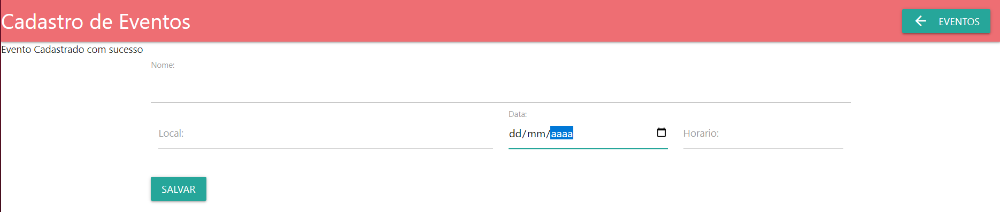

# API_REST_EVENTOSAPP

## Sobre o projeto
API REST que consiste em uma aplicação onde o usuário pode cadastrar eventos em um banco de dados, os eventos cadastrados por ele 
serão listados na página inicial da aplicação, onde, ao clicar em um dos eventos listados o usuário terá acesso ao uma tela de detalhes do evento
na qual ele poderá adicionar convidados ao evento em questão. Além disso, o usuário pode deletar tanto eventos quanto convidados no banco de dados por meio de requisições HTTP.

## Funcionamento da Aplicação 

### Tela inicial
Na tela de inicio o é feito uma requisição no banco que lista todos os eventos cadastrados para que o usuário tenha acesso as informações

Como não existe eventos cadastrados no banco ainda não será exibido nenhuma informação, então o usuário pode clicar no botão "cadastro de eventos" para que possa cadastrar um evento no banco

Na tela de cadastro de eventos o usuário preenche os campos e clica no botão de "Salvar"

Ao clicar em salvar é exibida a mensagem "Evento cadastrado com sucesso" e os campos são limpos para que o usuário cadastre outro evento caso queira, se não, o usuário pode clicar em 
"Eventos" para voltar para tela inicial

De volta na tela de Eventos os eventos cadastrados serão exibidos, ao clicar no nome do evento o usuário é direcionado para outra tela onde serão exibidas informações mais detalhadas sobre
o sistema.

Na tela de informações do evento são listadas as informações e a lista de convidados em branco, para adicionar os convidados o usuário deve preencher os campos de nome do convidado e RG

Ao clicar em salvar os campos são limpos para que outro convidado seja cadastrado e o nome cadastrado será exibido na lista de convidados.

Os convidados de um evento podem ser deletados do banco ao clicar no ícone da lixeira

Ao clicar no botão "Eventos" o usuário é redirecionado para a lista de eventos onde ele também pode deletar eventos clicando no ícone da lixeira

Quando um evento é deletado todos os convidados associados ao evento também são deletados do banco.